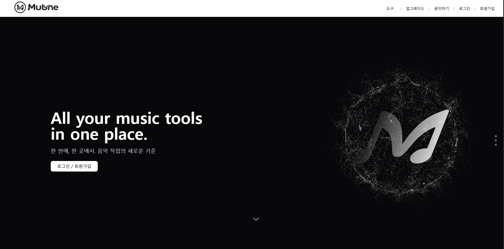

# MuTune Frontend

Backend Repository:  
https://github.com/Dun0318/mutune-backend

---

## 프로젝트 소개

MuTune은 음악인을 위한 웹 기반 음악 편집 SaaS 서비스입니다.

현재는 악보(PDF) 처리 기능을 중심으로 개발을 진행하고 있으며,  
백엔드에서 변환된 MusicXML 데이터를 브라우저에서 렌더링하고  
사용자가 직관적으로 확인할 수 있는 UI를 구현하는 것을 1차 목표로 하고 있습니다.

단순 화면 제작이 아니라, 실제 서비스 확장을 고려하여 다음 요소들을 함께 설계했습니다.

- 인증 상태에 따른 UI 분기 처리
- JWT 기반 API 통신 구조
- MusicXML 데이터 기반 동적 렌더링
- 확장 가능한 컴포넌트 구조 설계
- 반응형 레이아웃 설계

---

## Tech Stack

- React
- Vite
- Tailwind CSS
- Axios
- Spline (3D Hero Animation)
- JWT 기반 인증 연동
- Verovio (MusicXML 렌더링)

---

## 주요 기능

### 1. 랜딩 페이지

- Full screen 구조
- CTA 중심 설계
- 로그인 / 회원가입 유도
- 서비스 방향성 전달 UI 구성
- 스크롤 기반 섹션 전환 구조 설계
- Spline 기반 3D Hero 애니메이션 적용

메인 Hero 영역에는 Spline을 활용한 3D 오브젝트 애니메이션을 적용했습니다.  
정적 이미지가 아닌 인터랙티브 3D 요소를 통해 브랜드 아이덴티티를 시각적으로 전달하도록 구성했습니다.

React 상태 흐름과 충돌하지 않도록 렌더링 구조를 분리하고,  
초기 로딩 퍼포먼스를 고려해 3D 리소스 로딩을 설계했습니다.

---

### 2. 로그인 및 인증 처리

- JWT 기반 인증 구조
- Access Token 저장 후 API 요청 시 Authorization Header 자동 포함
- 로그인 상태에 따른 헤더 UI 분기 처리
- 인증이 필요한 페이지 접근 제어

백엔드의 Spring Security + JWT 구조와 연동하여  
Stateless 인증 흐름을 구현했습니다.

---

### 3. 악보 렌더링

- 백엔드에서 생성된 MusicXML 데이터를 수신
- Verovio 라이브러리를 사용하여 브라우저에서 악보 렌더링
- XML → SVG 변환 구조 적용
- 상태 기반 재렌더링 처리

단순 이미지 출력이 아닌  
동적 MusicXML 기반 렌더링 구조를 적용했습니다.

---

### 4. API 통신 구조

- Axios 인스턴스 분리
- 공통 Base URL 관리
- 요청 인터셉터를 통한 JWT 자동 삽입
- 에러 응답 처리 로직 분리

백엔드 구조와 맞춰 확장 가능하도록 설계했습니다.

---

- components: 재사용 가능한 UI 컴포넌트
- pages: 라우팅 단위 페이지
- api: Axios 설정 및 API 요청 관리
- hooks: 상태 및 로직 분리
- assets: 이미지 및 정적 파일

---

## 상태 관리 방식

- useState / useEffect 기반 상태 관리
- 로그인 상태 전역 관리
- API 응답 기반 조건부 렌더링 처리
- 렌더링과 데이터 로직 분리 구조 유지

현재 규모에 맞는 경량 구조로 설계했습니다.

---

## 반응형 설계

- Tailwind CSS 기반 유틸리티 스타일링
- Desktop 중심 설계 후 Mobile 대응
- 불필요한 복잡한 CSS 구조 제거

확장성과 유지보수를 고려한 구조입니다.

---

## 현재 구현 범위

- 랜딩 페이지 UI
- JWT 기반 로그인 UI
- 백엔드 API 연동 완료
- MusicXML 렌더링 구현 완료

MR 편집 및 AI 믹싱 기능 UI는 구현 예정 단계입니다.

---

## 향후 프론트엔드 확장 계획

### MR 키/템포 편집 UI

- 오디오 플레이어 기반 UI
- 키/템포 조절 슬라이더 구성
- 실시간 반영 구조 설계

### AI 원터치 믹싱 UI

- 트랙 업로드 화면
- 자동 분석 결과 시각화
- 초보자 중심 UX 설계

### 음악인 커뮤니티 확장

- 피드형 게시판 UI
- 작업물 업로드 구조
- 세션 매칭 화면 설계

### 모바일 앱 확장

- React Native 기반 앱 전환 고려
- 웹과 동일한 인증 및 데이터 구조 유지
- UI 컴포넌트 재사용 전략 설계

---

## 프로젝트 목적

이 프로젝트는 단순 화면 구현을 넘어,

- 백엔드 인증 흐름 이해
- MusicXML 데이터 렌더링 처리 경험
- API 기반 상태 제어 구조 설계
- SaaS 확장을 고려한 UI 구조 설계

를 직접 경험하기 위해 진행했습니다.

현재는 악보 기능 중심으로 구현되어 있으며,  
장기적으로 음악 제작부터 편집, 공유까지 하나의 흐름으로 연결되는 플랫폼으로 확장하는 것을 목표로 하고 있습니다.
